# Metrika Interaction to Next Paint (INP)

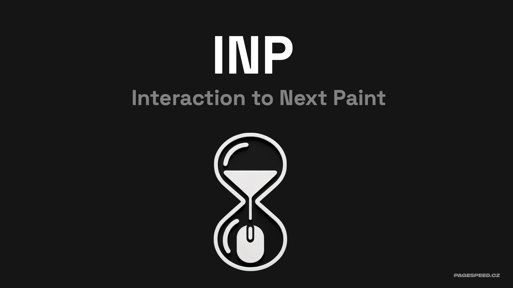

Vývojáři a majitelé webů, pozor. Pokud to ještě nevíte, Google přichází s novou metrikou Interaction to Next Paint (INP). Ta má v březnu roku 2024 v rámci tří nejdůležitějších metrik Core Web Vitals nahradit metriku First Input Delay (FID).

Interaction to Next Paint je přísnější a lépe odráží zkušenost uživatele s webem. Jde o metriku interaktivity, tedy rychlosti odpovědi na akci uživatele poté, co se stránka načetla a uživatel interaguje s komponentami jako jsou karusely, akordeóny nebo přidává zboží do košíku.

Optimalizace této metriky může zabrat i několik měsíců práce, proto je nejlepší čas se jí zabývat právě teď.

## Co je metrika INP?

INP odpovídá na otázku: Jak rychle to reaguje?

Interaction to Next Paint měří celkovou odezvu stránek na interakce uživatele sledováním prodlevy všech událostí, ke kterým dojde po celou dobu návštěvy stránek.

Doporučená hodnota pro splnění metriky je 200 ms. V rozmezí 200 až 500 ms je potřeba vylepšení a od 500 ms výše je metrika hodnocena jako špatná.

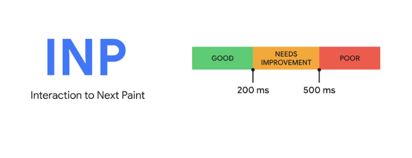  
_Metrika INP_

Google se touto změnou snaží vyřešit nedostatky FID. Inovace spočívá v tom, že INP měří všechny interakce (tap, kliknutí, zmáčknutí klávesy) na webu, které jako uživatel během procházení stránek provedete.

Zároveň měří trochu delší úsek činnosti prohlížeče. Jedná se o část od interakce až k překreslení stránky.

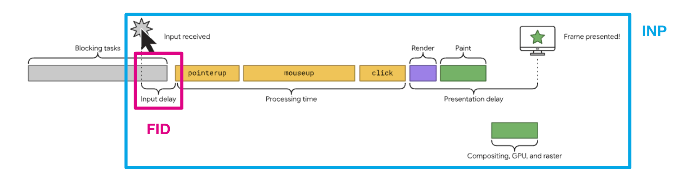  
_Metrika INP vs FID_

Pomoci s pochopením nám může přímé srovnání INP s její předchůdkyní FID:

| First Input Delay | Interaction to Next Paint |
|-------------------|---------------------------|
| první interakce   | všechny interakce na stránce |
| čas od interakce po zpracování | čas od interakce k překreslení stránky |
| limit 100 ms | limit 200 ms |

Pokud se vám tedy na webu často stává, že provádíte interakce, na které web nereaguje, nebo reaguje pozdě, bude zde problém s metrikou INP.

Hlavní příčinou vysokých hodnot INP bývá JavaScript a probíhající [dlouhé úlohy (Long Tasks)](https://web.dev/articles/optimize-long-tasks), které znemožní vykreslení nového stavu obrazovky („framu") v prohlížeči. Dalším viníkem může být například pomalé načtení dat po AJAXovém požadavku. Jejich optimalizaci se budeme věnovat dále v článku.

Pusťte si záznam Zuzčiny přednášky o metrice INP z FrontKonu 2023:

<iframe width="560" height="315" src="https://www.youtube.com/embed/b9XIeTLZO9I" frameborder="0" allow="accelerometer; autoplay; clipboard-write; encrypted-media; gyroscope; picture-in-picture" allowfullscreen></iframe>

## Jak se metrika INP počítá?

Nyní několik zajímavých detailů k výpočtu metriky. INP se měří na základě všech provedených interakcí na stránce. Interakce s nejhorším dosaženým měřením se pak započítává jako hodnota metriky. Mezi interakce nepočítáme scroll ani najetí kurzorem (hover), ale bere se odpověď klikání nebo zadávání přes klávesnici.

V případě velkého počtu interakcí se počítá jinak, na každých 50 interakcí na stránce je ignorována jedna nejvyšší hodnota. Google se tak snaží zpřesnit metriku a odstranit vliv různých náhodných záseků u webových aplikací, kde se hodně kliká, což mohou být různé herní rozhraní.

## Měříme INP

Jak jsme vysvětlili výše, zdrojem hodnot pro metriku INP je [Chrome UX Report](https://www.vzhurudolu.cz/prirucka/chrome-ux-report) (CrUX). Ten obsahuje jak data pro celou doménu, tak pro jednotlivé URL. Pro pohodlnější práci využijte některý z dostupných nástrojů, který s daty z CrUX umí pracovat a zobrazit je. Jedná se například o náš tester PageSpeed.cz nebo PageSpeed Insights od Googlu.

PageSpeed Insights vám zobrazí aktuální metriky Core Web Vitals jak pro mobily, tak desktop. Nahlédnout můžete také na data konkrétní URL adresy a celé domény. Druhý řádek uprostřed nás pak zajímá nejvíce, jelikož to je hodnota metriky INP.

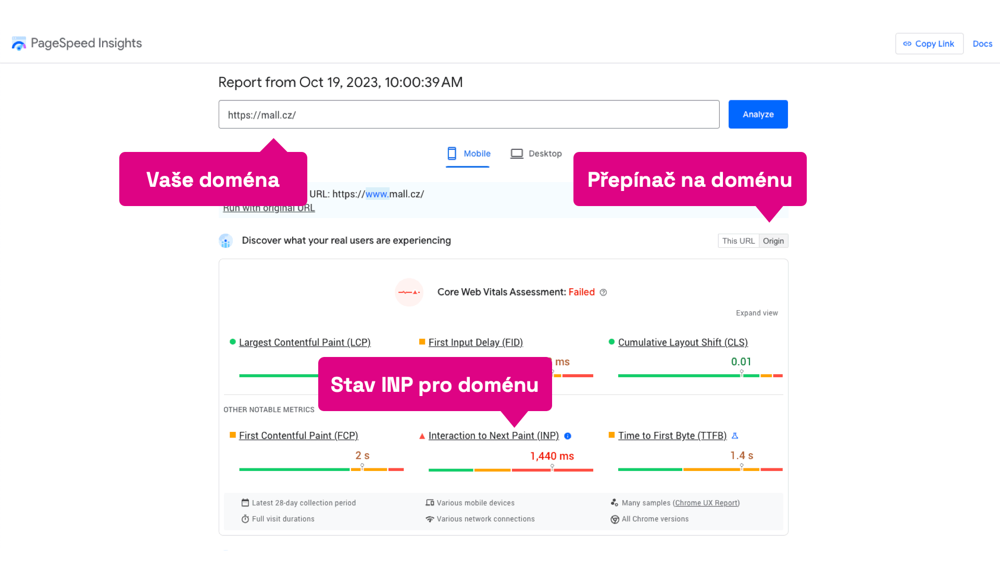  
_Měříme INP_

Dlouhodobý vývoj a pravidelné změny na webu nicméně potřebují jiný přístup, který zase nabízí náš [tester PageSpeed.cz](https://app.pagespeed.cz/). Hodnoty metrik můžete sledovat v dlouhodobém horizontu.

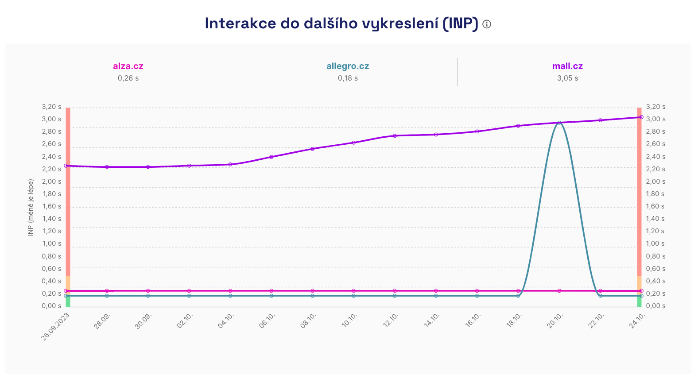  
_Metrika INP v našem testeru_

Velmi šikovný nástroj na sledování Core Web Vitals je také [Google Search Console](https://search.google.com/search-console/about), kde najdete nahlášené URL s „pokaženými" metrikami. Takto se dají poměrně jednoduše vytipovat potenciální problematické URL.

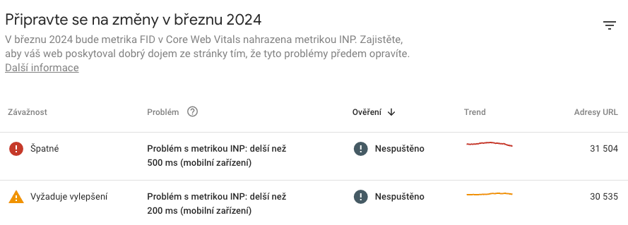  
_Google Search Console_

Pokud je pro vás omezení na uživatele Google Chrome příliš limitující, vždy můžete použít měření pomocí [RUM](https://developer.mozilla.org/en-US/docs/Glossary/Real_User_Monitoring) (Real User Monitoring), nebo si napsat vlastní sběr dat pomocí JavaScriptu a [Performance Observer API](https://developer.mozilla.org/en-US/docs/Web/API/PerformanceObserver).

Další možností jsou syntetická měření, která si můžete zajistit pomocí nástrojů jako je [SpeedCurve](https://www.speedcurve.com/), [Google Lighthouse](https://www.vzhurudolu.cz/prirucka/lighthouse), [WebPageTest](https://www.webpagetest.org/) a podobně. Zde ale dostanete jen hodnoty podobných metrik (jako JS Long Tasks), nikoliv INP samotné, protože tu lze dostat jen od uživatelů.

## Mám problém s INP, co teď?

Prošli jste si data z reportu CrUX ud uživatelů, mrkli jste se do Google Search Console a vidíte zde hlášené skupiny URL? Nyní je nejvyšší čas najít problém. Tedy přejít do testovacích nástrojů, případně testovat v prohlížeči (což děláme my) a vytipovat konkrétní problematická místa.

Pro rychlý pohled na interakce můžete využít [INP Debugger](https://www.debugbear.com/inp-debugger). Není to dokonalý nástroj, ale může pomoct vyhledat „dlouhé" interakce.

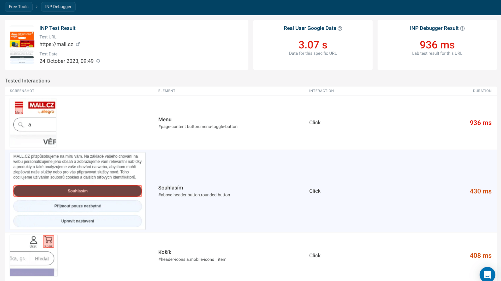  
_Nástroj Debugbear_

INP Debugger vám nezměří interakce vnořené ve skrytých prvcích a doporučujeme v něm spustit více testů, ať zjistíte, jak se daná stránka chová. Výsledkem je výpis interakcí seřazených podle naměřeného času INP.

Velkým pomocníkem při práci je rozšíření do [Chrome Core Web Vitals](https://chrome.google.com/webstore/detail/web-vitals/ahfhijdlegdabablpippeagghigmibma?gclid=Cj0KCQjw9fqnBhDSARIsAHlcQYSOvtD1Mltc_hGcfWgaCI2sH8jQk0TeGdfi5CtxL3uutvtWVmsxrzwaAinjEALw_wcB), které kromě všeho ostatního umí vypisovat všechny metriky do konzole. Otevřete si tedy DevTools, v záložce Performance si nastavte nastavit CPU: 6x slowdown a Network: Fast 3G, abyste si zpomalili výkon zařízení.

  
_Chrome Core Web Vitals extension_

V posledním kroku běžte do záložky Console a zapněte si Core Web Vitals rozšíření. Nyní můžete začít testovat jednotlivé stránky. Pokuste se otestovat všechny možné scénáře a interaktivní prvky, hodnota metriky INP se vám vypíše do konzole.

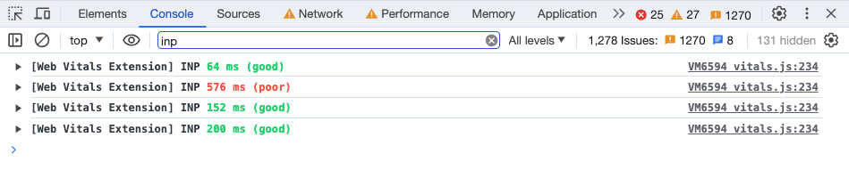  
_Chrome Core Web Vitals - výpis do konzole_

Rozebrat do podrobna konkrétní interakce pak můžete za pomoci nahrávání Timeline v záložce Performance. Pokud si nahrajete konkrétní interakci, tak v záložce „Interactions" uvidíte přesně, kdy se stala.

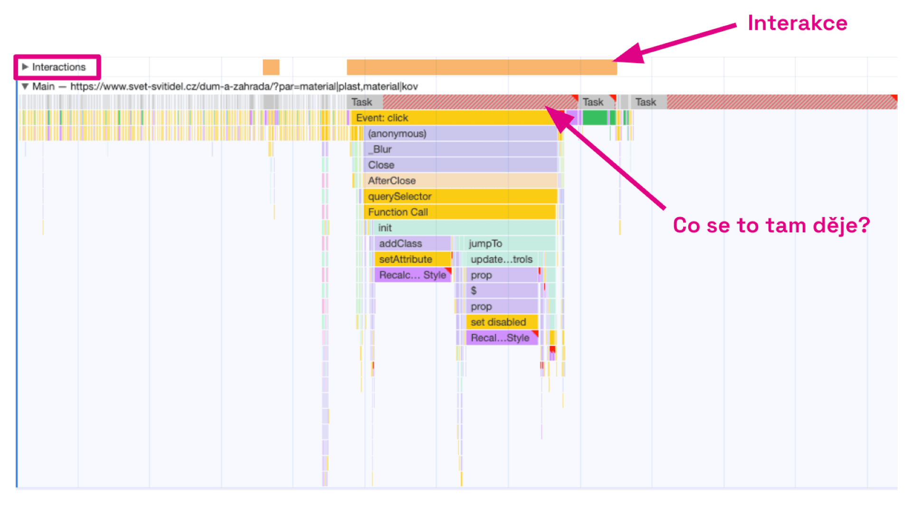  
_Performance tab - timeline_

Záložka „Main" pak reprezentuje spuštěné skripty a metody, které nám odpovídají na otázku „Co se to tam děje?"

## Jaké jsou časté chyby a možnosti optimalizace?

Interaction to Next Paint je hlavně javascriptová metrika, ale dost věcí se dá vyřešit i úpravou UI.

### Nenechte uživatele čekat na odezvu

Po uživatelské interakci musí co nejdříve dojít ke změně vykreslení na obrazovce uživatele. Jestliže dojde k AJAX/Fetch requestu, uživatel často neví, že se na něco čeká. Je potřeba, aby dostal vizuální odezvu co nejdříve. Proto reagujte změnou laoyutu a vykreslením indikátoru načítání.

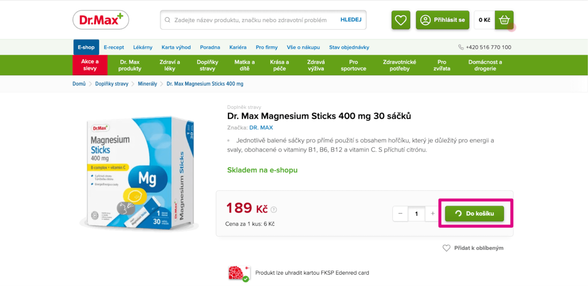  
_Nenechte uživatele čekat na odezvu_

### Po kliknutí nespouštěte JS kód, který můžete odložit

Odložte události jako různá měření a odesílání měřících kódů až po tom, co rozhraní zareaguje. Dlouhé úlohy, spouštěné např. v GTM na klik tlačítka, prodlužují reakci rozhraní a zhoršují metriku INP.

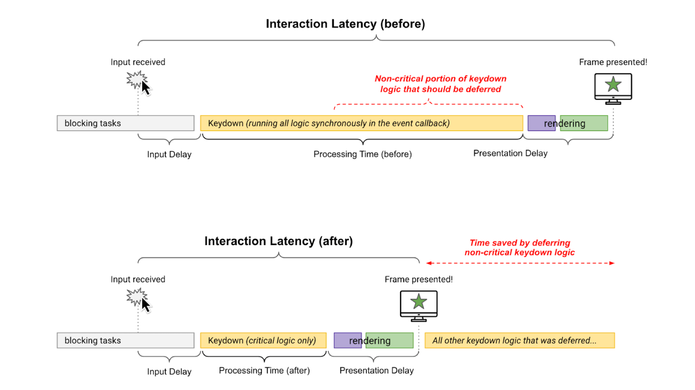  
_Po kliknutí nespouštěte JS kód, který můžete odložit_

### Eliminujte dlouhé úlohy (Long Tasks) v JavaScriptu

JavaScriptový kód může tvořit Long Tasky. Tyto úlohy je potřeba rozdělovat na menší úkoly, které se budou vykonávat po sobě a neblokují odpověď. Nejjednodušší cestou, jak Long Tasky rozdělit, je obalit kód do [funkce setTimeout](https://web.dev/articles/optimize-inp#yield_to_the_main_thread_often).

```js
document.addEventListener ( 'DOMContentLoaded", function () {
  setTimeout (() => {
    // Zde je volání vašich funkcí
  }, 0);
});
```

Zajímavých možností optimalizace INP je spoustu, doporučujeme se zamyslet také nad následujícím:

- Optimalizací rychlosti odezvy Fetch/Ajax.
- Minimalizováním DOMu, využití „lazy loadu pro DOM" [content-visibility](https://developer.mozilla.org/en-US/docs/Web/CSS/content-visibility).
- Do budoucna bude na místo setTimeout() zajímavý [scheduler.yield()](https://developer.chrome.com/blog/introducing-scheduler-yield-origin-trial/), [Long Animation Frames API](https://developer.chrome.com/articles/long-animation-frames/).

Chcete pomoci s INP? Využijte naši novou službu [SpeedSprint](https://www.pagespeed.cz/speedsprint).

Co bychom si měli o INP zapamatovat
-----------------------------------

- Interaction to Next Paint (INP) měří celkovou odezvu stránek na interakce uživatele sledováním prodlevy všech událostí, ke kterým dojde po celou dobu návštěvy stránek uživatelem.
- Doporučené hodnoty pro INP jsou do 200 ms, 200 až 500 ms sekundy vyžaduje úpravy a nad 500 ms je INP nevyhovující.
- Google plánuje, že se INP stane součástí Core Web Vitals v březnu 2024, kdy nahradí metriku FID.
- Při optimalizaci INP se zaměřte na odstranění dlouhých úloh v JavaScriptu (Long Tasků), nenechte čekat uživatele na odevzu a odložte JS kód, který nepotřebujete okamžitě spustit.