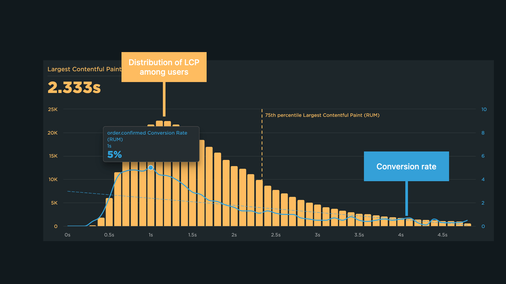

# Metrika Largest Contentful Paint (LCP)


Svět metriky Largest Contentful Paint (LCP) by se dal přirovnat k adrenalinovému prostředí automobilových závodů - jde o nekonečný souboj s časem. Pojďme teď projet všechny zatáčky a nástrahy naší závodní dráhy, ať jsme co nejlépe připravení. Co se tedy dozvíme?

- Co je metrika LCP?
- Jaké jsou její doporučené hodnoty?
- Proč je důležitá?
- Jak se metrika LCP počítá?
- Jak a kde ji doporučujeme měřit?
- Jaké jsou časté chyby a možnosti optimalizace?

## Seznamte se s metrikou LCP

Metrika LCP měří dobu, po které na stránce zobrazí největší element. To pomáhá uživatelům vyhodnotit užitečnost stránky.

Tato metrika je součástí [Core Web Vitals](https://www.vzhurudolu.cz/prirucka/web-vitals), používaných pro měření rychlosti načítání webových stránek. Metriky Core Web Vitals jsou také jedním ze signálů zohledňovaných Googlem při řazení výsledků výhledávání.

## Držte LCP pod 2,5 sekundy

Pokud chcete mít Largest Contentful Paint v zeleném vyhovujícím pásmu, hodnota musí být do 2,5 sekundy. LCP mezi 2,5 až 4 sekundy je v oranžovém pásmu a vyžaduje úpravy. Čas metriky LCP nad 4 sekundy Google hodnotí jako nevyhovující.

|  | Dobrá | Vyžaduje zlepšení | Špatná |
| --- | --- | --- | --- |
| LCP | ≤ 2,5 s  | 2,5 - 4 s  | > 4 s  |

Metrika Largest Contentful Paint (LCP) je důležitá z několika klíčových důvodů, které mají zásadní vliv na celkový uživatelský zážitek a úspěšnost webových stránek.

Patří mezi ně například snížení míry okamžitého opuštění webu, vliv na konverze e-shopů, důvěryhodnost značky nebo pozice ve výsledcích vyhledávání.



Metrika LCP na webech našich klientů často koreluje s konverzním poměrem. Toto děláme v rámci [analýzy konverzí](https://www.pagespeed.cz/speedcurve-rum-analyza-konverzi).

Co je to LCP element?
---------------------

Zjednodušeně jde o největší vizuální prvek na stránce, který je zobrazen během procesu načítání stránky v hlavním viewportu uživatele. LCP element je ten prvek, který prohlížeč sleduje a měří dobu, za jakou nastane jeho zobrazení.

LCP element můžeme identifikovat v některém z vývojářských nástrojů - Lighthouse, Performance Tab v DevTools nebo Web Vitals rozšíření do Chrome. Do detailu si můžete o hledání a testování (nejen) LCP přečíst v mém článku [Klíčová dovednost vývojáře: testování Web Vitals v prohlížeči](https://www.pagespeed.cz/blog/testovani-web-vitals-v-prohlizeci).

Jako [LCP element](https://www.w3.org/TR/largest-contentful-paint/) se mohou vyhodnotit následující prvky:

- `` elementy
- `<image>` element uvnitř `<svg>` elementu
- `<video>` element s „poster" obrázkem
- obrázek na pozadí, pomocí vlastnosti `background-image` ([CSS gradient](https://developer.mozilla.org/docs/Web/CSS/CSS_Images/Using_CSS_gradients) je ignorován)
- [block-level](https://developer.mozilla.org/docs/Web/HTML/Block-level_elements) elementy obsahující text nebo další textové inline-level potomky

LCP elementem naopak nemohou být následující prvky:

- Elementy s vlastností `opacity: 0` a dalšími, které jsou pro uživatele neviditelné.
- Elementy, které vyplňují celý viewport. Ty jsou spíše považovány za ilustrační než obsahové.
- Zástupné obrázky s nízkou mírou obsažené informace. Zde jde o ochranu před LCP hacky, kdy vývojáři vložili do stránky velký obrázek bez informace. Pokud máte pochybnosti o míře informací ve vašich obrázcích, můžete si je otestovat v [kalkulačce](https://bpp-calculator.netlify.app/) Image BPP (bits per pixel).

  
_Základem je identifikovat „LCP element". Jen pozor, na v různých rozlišeních může jít o různý prvek._

## Jak se LCP element vyhodnocuje?

Pro správné vyhodnocení a optimalizace je potřeba pochopit, jak se metrika LCP počítá. U LCP elementu se obvykle vyhodnotí jeho velikost viditelná na obrazovce uživatele. V úvahu se neberou ořezané části, části skryté pomocí `overflow:hidden`, ani vlastností `padding`, `margin`, `border` a další. Pokud chcete do detailů vyhodnocení LCP zabrousit více, je tu na toto téma fajn článek na [web.dev](https://web.dev/lcp/#how-is-an-elements-size-determined).

## Měříme LCP na vlastním webu

Spolehlivným zdrojem dat o metrikách Core Web Vitals jsou datasety [Chrome UX Reportu](https://www.vzhurudolu.cz/prirucka/chrome-ux-report) (CrUX). S těmito daty můžete pracovat jak pro celou doménu, tak pro jednotlivá URL.

Práce se surovými CrUX daty je nicméně docela náročná na technické schopnosti. Naštěstí již máme nástroje, které tato data zpracovávají a zobrazují v grafech automaticky. Jedná se Pagespeed.cz nebo Pagespeed Insights.

Základní data o stavu metriky LCP vám poskytnou [PageSpeed Insights](https://pagespeed.web.dev/). Pokud chcete mít přehled o vývoji v čase, vyzkoušejte [náš tester](https://app.pagespeed.cz/).

Pokud je pro vás omezení na uživatele prohlížeče Chrome příliš limitující, vždy můžete přistoupit k vlastnímu měření pomocí [RUM](https://developer.mozilla.org/en-US/docs/Glossary/Real_User_Monitoring) (real user monitoring), nebo si napsat vlastní sběr dat pomocí JavaScriptu a [Performance Observer API](https://developer.mozilla.org/en-US/docs/Web/API/PerformanceObserver).

Google Search Console je jedním ze zdrojů, které nám dají důležité informace o prioritách při optimalizaci LCP.

Další možností jsou syntetická měření, která si můžete zajistit pomocí nástrojů jako je SpeedCurve, Google Lighthouse, WebPageTest a podobně.

## Chyby a možnosti optimalizace LCP

Metrika LCP je poměrně komplexní. Je potřeba si uvědomit, že ji může ovlivnit spousta faktorů. V první řadě se jedná o zdroje kritické pro první vykreslení:

- Rychlost času backendu (TTFB).
- Velikost a složitost HTML.
- Velikost CSS a dalších kritických zdrojů.

  
_Optimalizace času backendu (metrika TTFB) velmi často pomůže ke zlepšení metriky LCP._

Do LCP se ale počítají i asynchronní zdroje, tedy například obrázky nebo webfonty, které mohou tvořit LCP element. LCP tedy může ovlivnit i následující:

- Formát, fyzická a datová velikost samotného obrázku.
- Velikost souborů s fonty atd.
- Přítomnost obrázku v atributu poster značky `<video>`.

Obecně tedy držte všechny časy a velikosti na co nejnižší úrovni. Náš tajný tip? Používejte líné načtení obrázků a používejte jej dobře.

  
_Tady by lazy loading pomohl. Líně načtené obrázky (všechny kromě prvního) by pomohly prioritizaci prvního obrázku, který má vliv na LCP._

LCP ale můžete zlepšit i komplexnějšími úpravami, které si popíšeme níže:

### Lazy loading může uškodit LCP

Pravidlo je takové, že se obrázky bez líného načtení v prohlížeči stahují jako první. Obrázky s lazy loadingem až posléze, i když jsou ve viditelné části viewportu. Pokud máte lazy loading na obrázku, který je zároveň LCP element, stáhne se o dost později, což zvyšuje čas LCP. Z LCP prvků na vašem webu proto odstraňte lazy loading a na všechny ostatní prvky lazy loading naopak přidejte:

```html

```

### Fetch Priority popostrčí stahování souboru

Složitá struktura HTML nebo příliš mnoho stahovaných souborů může způsobit, že náš LCP prvek se bude stahovat příliš pozdě. Pomocí atributu [fetchpriority](https://web.dev/fetch-priority/) ale můžeme zvýšit prioritu vybranému stahovanému souboru. To zlepší metriku LCP. S touto technikou je nicméně potřeba zacházet opatrně a dopad [důkladně otestovat](https://www.pagespeed.cz/blog/testovani-web-vitals-v-prohlizeci).

```html

```

### Preloadujte zdroje webfontů LCP elementů

Pokud zjistíte, že jako LCP element se na stránce vyhodnotí textový prvek, musíte zajistit co nejrychlejší stažení souborů s webfonty a jejich zobrazení. Abyste tohoto cíle dosáhli, můžete využít techniky přednačtení (preload). Drobné upozornění: Preloadem je potřeba šetřit, proto preloadujte učitě jenom ten jediný řez fontu, který má vliv na LCP:

```html
<link rel="preload" href="font-1.woff2" as="font" type="font/woff2" crossorigin>
```

## Co byste si měli ohledně LCP zapamatovat

- Largest Contentful Paint (LCP) je metrika měřící dobu, kdy se na stránce zobrazí největší vizuální prvek.
- Doporučené hodnoty pro LCP jsou do 2,5 sekundy, 2,5 - 4 sekundy vyžaduje úpravy a nad 4 sekundy je LCP nevyhovující.
- LCP je klíčová součást Core Web Vitals, která ovlivňuje uživatelský zážitek a velmi často také míru opuštění webu, konverze e-shopů nebo jejich pozice ve vyhledávačích.
- Při optimalizaci LCP se zaměřte na zlepšení rychlosti načítání kritických zdrojů, správné použití lazy loadingu nebo využití atributu `fetchpriority` pro zvýšení priority stahování souborů.

_Ilustrace z hlavního obrázku: [Unsplash](https://unsplash.com/photos/HUJDz6CJEaM)._